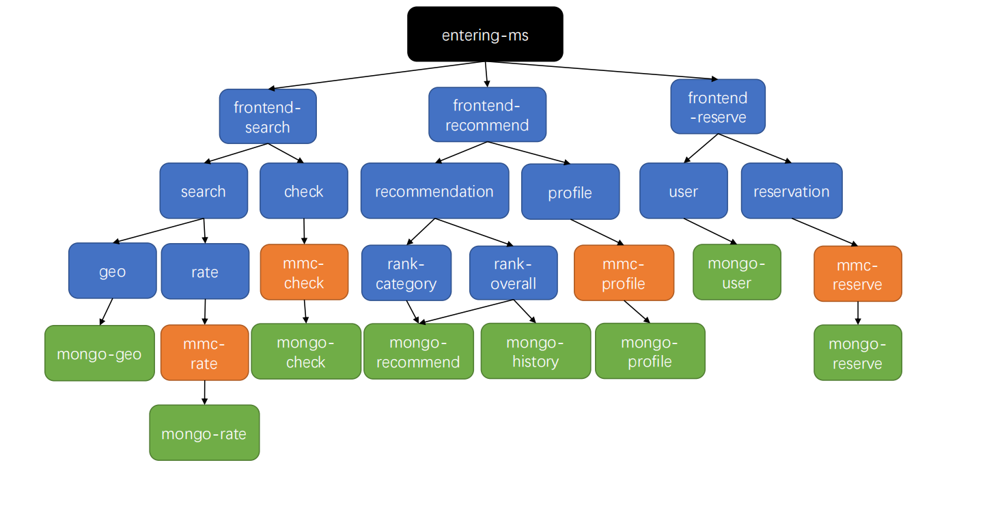

# hotelReservation

This benchmark is based on [DeathStarBench/hotelReservation at master · delimitrou/DeathStarBench (github.com)](https://github.com/delimitrou/DeathStarBench/tree/master/hotelReservation). 

To add dynamic call graphs, we revised this benchmark and added more microservices. At present, this benchmark consists of 5 different call graphs. The parameters of the request determine the call graph used for queries.

We add new branch option to recommend. When require is equal to dis/price/rank, the category-rank module is invoked to recommend the best hotel for the user according to distance/price/score. When require is equal to overall, the overall-rank module is invoked to comprehensively recommend hotels based on multiple indicators including previous reservation history.

We also add new branch option to search. When require is equal to nearby, search and show results based on distance; when require is equal to rate, search and show results based on hotel rating. 

The structure of this benchmark is shown as follows.



# Deploy the benchmark 

```
kubectl apply -f /k8s-yaml
```

# A basic sample

Here is a basic shell sample, covering all dynamic graphs.

```bash
url=xxxxx # ip of entering-ms

# search
curl "${url}:5000/hotels?inDate=2015-04-01&outDate=2015-04-03&lat=38&lon=-122&require=nearby" # according to distance
curl "${url}:5000/hotels?inDate=2015-04-01&outDate=2015-04-03&lat=38&lon=-122&require=rates" # according to rate

# recommend
curl "${url}:5000/recommendations?lat=38&lon=-122&require=dis&username=Cornell_1" # according to distance
curl "${url}:5000/recommendations?lat=38&lon=-122&require=price&username=Cornell_1" # according to price
curl "${url}:5000/recommendations?lat=38&lon=-122&require=rate&username=Cornell_1" # according to rate
curl "${url}:5000/recommendations?lat=38&lon=-122&require=overall&username=Cornell_1" # according to overall rate

# reservation
curl "${url}:5000/reservation?inDate=2015-04-01&outDate=2015-04-03&hotelId=1&username=Cornell_1&password=1111111111&number=1&customerName=Cornell_1"

```

# Load generator

We implement an asynchronous load generator using python3

```shell
cd LoadGenerator
pytyhon3 LoadGenerator.py
```

You can change qps, test duration and other options in LoadGenerator.py
